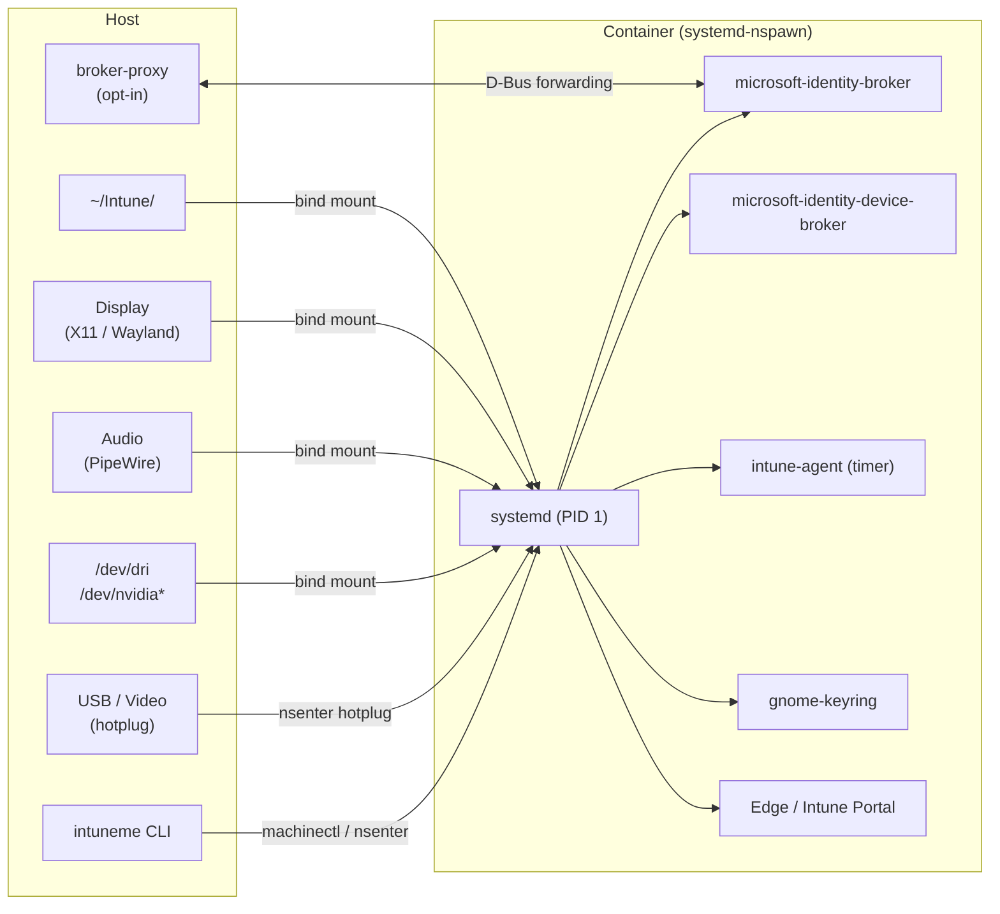

# intuneme

Run Microsoft Intune on an immutable Linux host — without touching the host system.

---

## How it works

`intuneme` provisions and manages a [systemd-nspawn](https://www.freedesktop.org/software/systemd/man/systemd-nspawn.html) container running Ubuntu 24.04. Inside the container, a full systemd instance runs as PID 1 with its own D-Bus buses, gnome-keyring, and user session. Intune Portal, the Microsoft Identity Broker, and Microsoft Edge all run inside this isolated environment.

The host provides display, audio, and GPU access through targeted bind mounts. A dedicated `~/Intune` directory on the host serves as the container user's home — preserving enrollment state, browser profiles, and downloads across container rebuilds.

---

## Key features

- **Container lifecycle management** — `init`, `start`, `stop`, `destroy`, and `recreate` commands handle the full container lifecycle, including image pulls, user provisioning, and enrollment-safe upgrades.
- **Broker proxy (host-side SSO)** — An opt-in D-Bus forwarding proxy lets host apps (Edge, VS Code) authenticate via the container's Intune enrollment — no re-authentication needed on the host.
- **Device hotplug** — YubiKey USB security keys and webcams are automatically forwarded into the container via udev rules. Plug in, plug out; the container tracks it.
- **GNOME Quick Settings extension** — A one-click toggle in GNOME Quick Settings starts or stops the container and provides shortcuts to launch Edge and Intune Portal.
- **Nvidia GPU support** — Nvidia GPUs are auto-detected at boot. Host driver libraries, device nodes, and Vulkan/EGL vendor files are forwarded into the container — no manual setup required.
- **Desktop shortcuts** — `.desktop` entries for Edge and Intune Portal integrate with the GNOME application grid so you can launch corporate apps like any other app.
- **Auto-generated CLI reference** — Full command and flag documentation generated from the source.

---

## Get started

[Get started](getting-started/prerequisites.md){ .md-button .md-button--primary }
